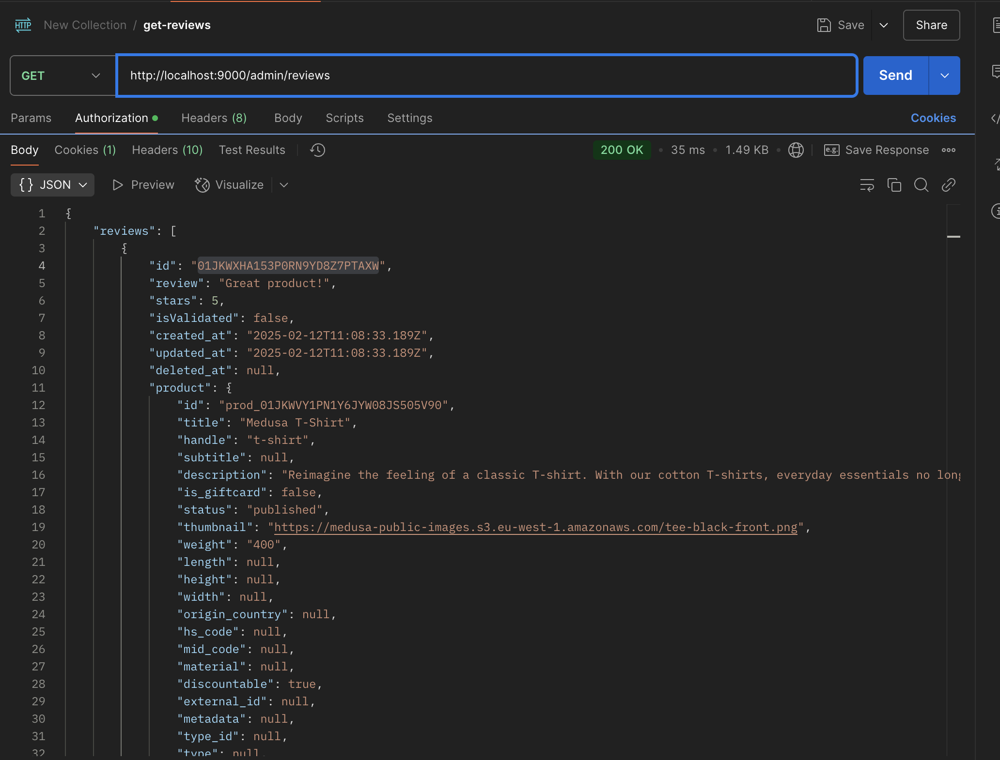

# Patch Request Failing with "Review with id \"\" not found" Error

## Issue Overview

I am encountering an issue while making a `PATCH` request to the API endpoint `admin/reviews/:id` to update a review. Although the server logs show that the user and review are successfully retrieved along with the correct ID, the request fails with the following error:

```json
{
  "message": "An unexpected error occurred",
  "error": "Review with id \"\" not found"
}
```

## Expected Behavior

- The API should update the review with the provided ID.
- The response should indicate a successful update, such as a `200 OK` status with the updated review object.

## Current Behavior

- The server retrieves the user and the review, and logs both with the correct ID.
- Despite this, the API returns an error indicating that the review with the given ID is not found.

## Steps to Reproduce

1. Send a `PATCH` request to the endpoint `admin/reviews/:id` with a valid review ID and the required data in the request body.
2. Check the server logs to confirm that the review and user are correctly retrieved and logged.
3. Observe the error response.

## Verifying the Review's ID

To ensure the given review's ID is correct, perform the following steps:

1. Retrieve the list of reviews via the API or database query to confirm the ID exists.
2. Use a `GET` request to the endpoint `admin/reviews` to confirm the review can be retrieved.
3. Check the database directly to ensure the review's ID matches the one being sent in the `PATCH` request.

**Attach screenshot of the review retrieval process here:**  


## Logs and Observations

Here are the relevant logs showing the review and user being retrieved:


## Sample cURL Request

Below is an example of the `PATCH` request being made:

```bash
curl -X PATCH "http://localhost:9000/admin/reviews/12345" \
-H "Authorization: Bearer <your-token>" \
-H "Content-Type: application/json" \
-d '{
  "title": "Updated Review Title",
  "content": "Updated review content."
}'
```


## Workflow and API Request Files

For reference, here are links to the actual files in the project related to this process:

- **Workflow File:** [`src/workflows/validate-reviews.ts`](./src/workflows/validate-reviews.ts)  
  This file contains the logic to validate reviews before processing the request.

- **API Request File:** [`src/api/admin/reviews/[id]/route.ts`](./src/api/admin/reviews/[id]/route.ts)  
  This file defines the `PATCH` request handler for updating reviews.

## Possible Causes

- The ID might be missing or incorrectly parsed in the request handler.
- Middleware or validation logic could be altering the request data.
- There may be a mismatch between the logged data and the data being used for validation.

## Environment Details

- **MedusaJS Version:** 2.4.0
- **Database:** PostgreSQL 17.2
- **Operating System:** macOS 15.2
